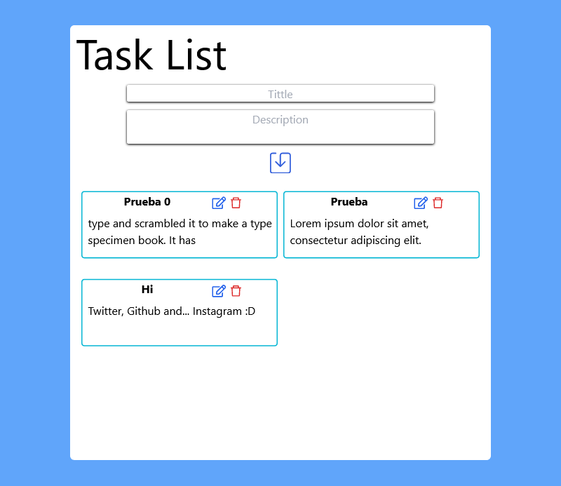

# TaskList App

Small task app, where you can add, view, delete and edit tasks.

## Technologies
A list of technologies used within the project:
* [Tailwind](https://vitejs.dev/): Version 3.0.24 
* [Vite](https://tailwindcss.com/): Version 2.9.9
* [React.js](https://es.reactjs.org/) : Version 18

### Screenshot


## Installation
***
A little intro about the installation. 
```
$ git clone https://github.com/Dalex19/TaskList-App.git
$ cd task-app
$ npm install or npm i
$ npm run dev
```